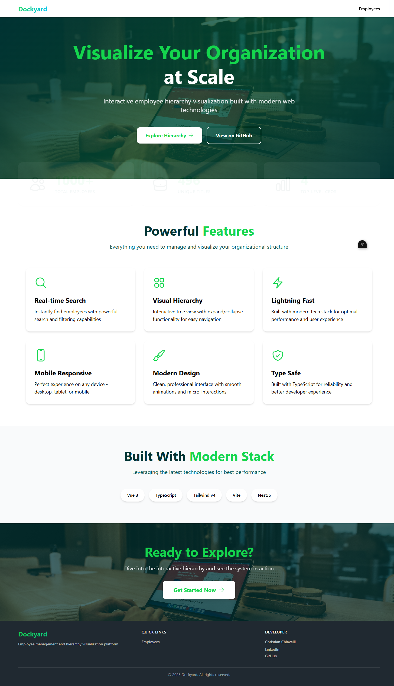
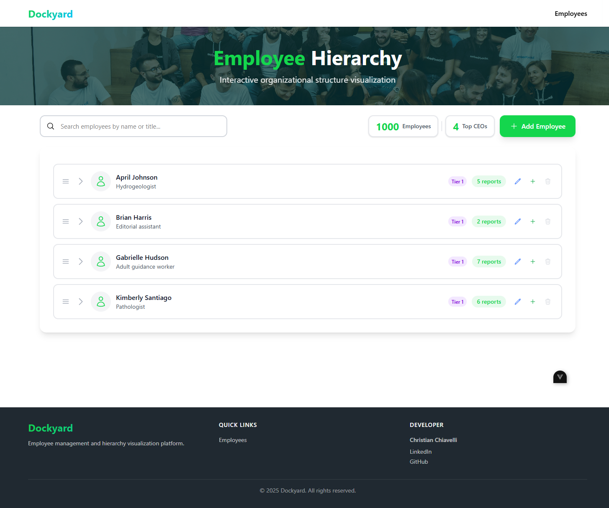

# Dockyard - Employee Hierarchy Management System

Full-stack application for managing employee hierarchies with drag-and-drop functionality.

## Screenshots

### Landing Page


### Employee Hierarchy with Drag & Drop


## Project Structure

```
loadsmart/
├── dockyard-backend/     # NestJS API
└── dockyard-frontend/    # Vue 3 Application
```

## Documentation

- [Backend README](./dockyard-backend/README.md)
- [Frontend README](./dockyard-frontend/README.md)

## Tech Stack

**Backend:** NestJS, TypeORM, SQLite  
**Frontend:** Vue 3, TypeScript, Pinia, Tailwind CSS
